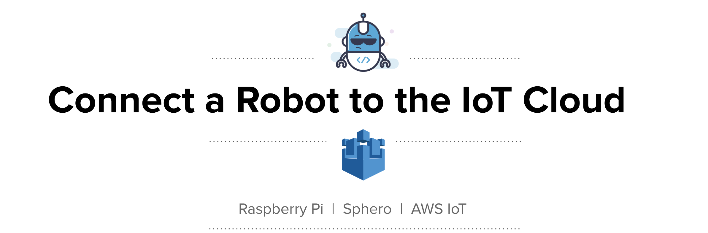
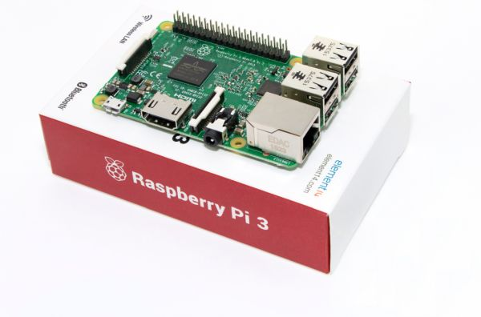
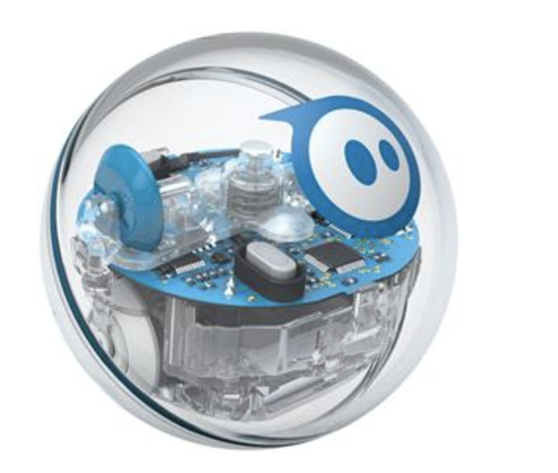

------

------

## Welcome

We're connecting a Sphero robot to the AWS IoT Cloud via a Raspberry Pi!

<b>The aim of the day is to learn new things. You do not need to achieve specific goals.</b> The agenda of the day caters for varying levels of experience and different people will learn different things by playing with the same tools.

## Preparing for the Make Day

Before you attend the Make Day, there are a couple of basics you should have under your belt. Makers that arrive well prepared get the most out of their Make Days.

We've compiled an introduction to the technologies you'll be playing with, as well as some activities you can run through. If you get stuck on any of these, please shout in Make Slack.

### First steps

- [ ] Check the [agenda and location](agenda.md) for the Make Day
- [ ] Think of one thing you'd like to figure out and share it with your team on [#make-oscar Slack](https://offerzen-make.slack.com/messages/C9XAJF4QK)

### Raspberry Pi

A Raspberry Pi is simply a very small and cheap computer that runs Linux. There are some
[amazing Pi projects](http://www.trustedreviews.com/opinion/best-raspberry-pi-projects-pi-3-pi-zero-2949390) out there, and for this course we're going to be using the Pi as the mechanism for connecting our Sphero to the IoT Cloud. We'll be using the Pi 3 for this course, so [have a look at its specs](https://www.raspberrypi.org/products/raspberry-pi-3-model-b/) if you're curious.

The OS we'll be using is Raspbian, which is a Debian-based Linux distro that is highly optimized for the Raspberry Pi's ARM CPUs. <b>If you are unfamiliar with the Linux command line then watch [this video](https://www.youtube.com/watch?v=RuusmAGbnOo).</b>

### AWS IoT

<i>If you knew the state of every thing in the world, and could reason on top of the data: What problems would you solve?</i>

IoT simply means that devices are connected to the internet and are sending and receiving data or instructions to and from an IoT platform. AWS provides [several services](https://aws.amazon.com/iot/) for managing IoT devices. We'll be using the [AWS IoT Core](https://aws.amazon.com/iot-core/) service for connecting and managing our Spheros. If you are completely new to IoT, then watch <b>[this fantastic introduction](https://www.youtube.com/watch?v=WAp6FHbhYCk)</b> to AWS IoT to get a better idea.

* <b>Prep Activity:</b> [PubSub via AWS Dashboard](https://github.com/OfferZen-Make/iot_robots-pub_sub_via_aws_dashboard).

* <b>Prep Activity:</b> Watch the video and learn how to [add a device to the IoT Cloud](https://www.youtube.com/watch?v=sq_l2J4oyLU). Then, you can optionally follow the instructions to create a <b>certificate</b> and <b>policy</b>, and then register a <b>thing</b>.

### Sphero

The robot we'll be using is the [Sphero Sprk+](https://www.sphero.com/sprk-plus). Sphero is a Bluetooth Low Energy (BLE) device that can move around and change colour. It has a top speed of 2 meters per second (!) and [you'd be surprised to see](https://www.youtube.com/watch?v=1S5lUDvlu3A) how much it can do.

You're going to be controlling Sphero programmatically - first locally with a Raspberry Pi, and then via the AWS IoT Service. We'll be using the [official Sphero Javascript SDK](https://github.com/orbotix/sphero.js). Since you (probably) don't have a Sphero at home, we've created a small Javascript project that will get you familiar with Sphero's basic commands.

* <b>Prep Activity: </b> [Control a virtual Sphero with JavaScript](https://github.com/OfferZen-Make/iot_robots-control_virtual_sphero_javascript).

There is a fantastic robotics/IoT framework written in [Go called Gobot](https://gobot.io/). If you love Go and/or you want to challenge yourself during the day, then check out [the repo](https://github.com/hybridgroup/gobot) and look at the Sphero Sprk+ examples. <b>Be warned</b>, this is not an official SDK and we've not (as yet) done extensive testing for Sphero with Gobot! Make Day is about exploring, playing and learning, so feel free to go for it if you are up for the challenge :).

 

-----
